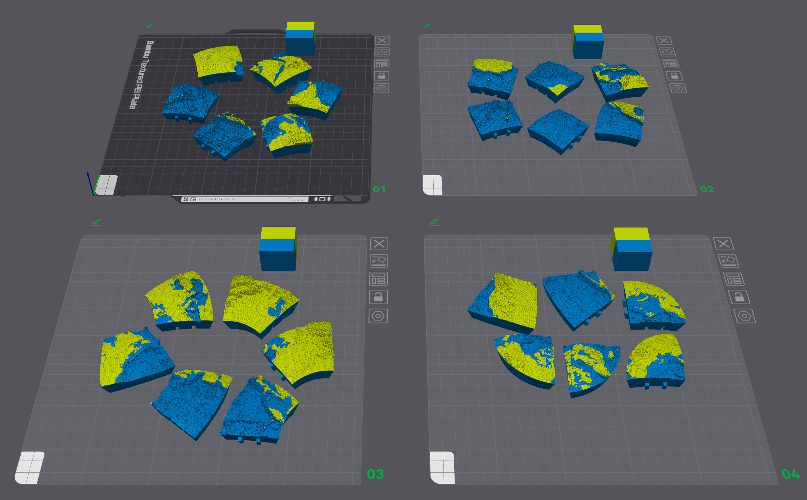
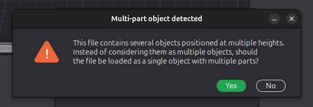
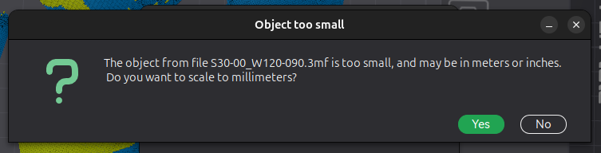
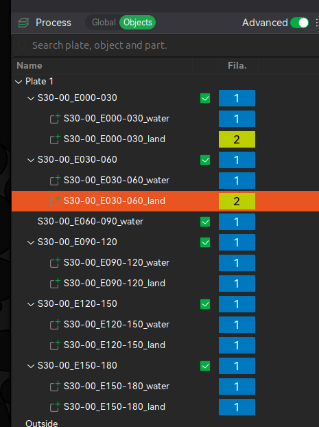
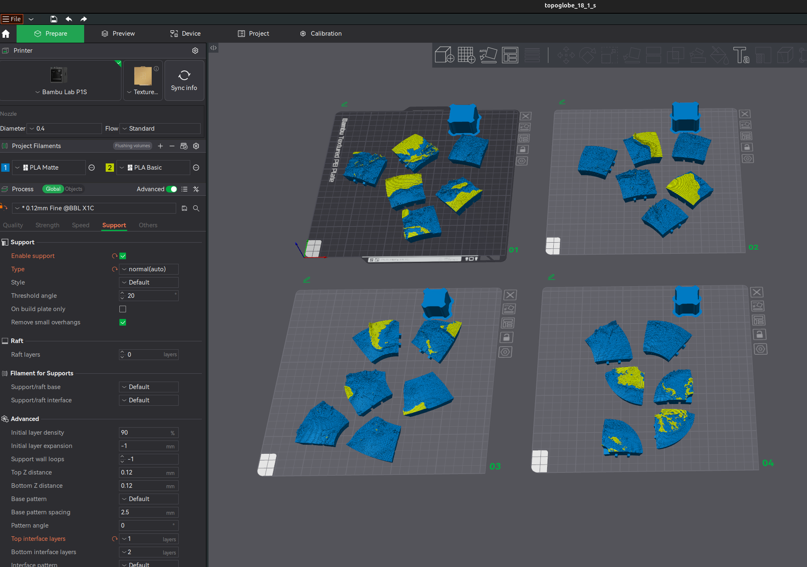

# 3D Globe Segment Generator

Generate 3D-printable segments that assemble into a globe showing the Earth's ocean depth (Bathymetric) and land height (Topographic, or Raised-Relief).

## Overview

This python program combines elevation data and optional snow coverage data to create 3D models of Earth with raised relief features. The globe is divided into 48 segments that can be 3D printed and assembled. It was developed with the help of Claude Code.

## Appearance



## Installation

### Python Dependencies

Install required Python packages:
```bash
pip install -r requirements.txt
```

Required packages:
- numpy >= 1.26.0
- polars >= 1.35.0
- xarray >= 2025.11.0
- rasterio >= 1.4.0
- pyyaml >= 6.0
- trimesh >= 4.0.0
- scipy >= 1.11.0
- networkx >= 3.0
- lxml >= 4.9.0

## Configuration

Download the required data files and place them in the `data/` directory, then edit `config.yaml`:

```yaml
# Data files
etopo_path: "./data/ETOPO1_Bed_g_gmt4.grd"
snow_path: "./data/MOD10CM_snow_2024-153.tif"  # Optional

# Globe parameters
radius_mm: 90.0              # Base radius in millimeters
elevation_range_mm: 15.0     # Height range for elevation features
min_height_mm: 0.2           # Minimum feature height
shell_thickness_mm: 7.0      # Wall thickness of the globe shell

# Grid parameters
step_deg: 0.333333           # Grid cell size in degrees (~37km at the equator)

# Output
output_dir: "./output"       # Directory for 3MF files
```

## Usage

### Generate All 48 Segments

```bash
python3 globe.py
```

This will generate all globe segments (without snow) and save them as 3MF files in the output directory. Takes approximately **9-10 minutes** for all 48 segments at 0.333333° resolution.

### Generate Specific Segments

```bash
python3 globe.py -s N60-90_E000-090 N60-90_E090-180
```

### Enable Snow Layer

```bash
python3 globe.py --snow
```

Snow is disabled by default for faster processing. Use `--snow` to include snow coverage data.

### Command Line Options

```
usage: globe.py [-h] [--config CONFIG] [--segments SEGMENTS [SEGMENTS ...]]
                [--output-dir OUTPUT_DIR] [--snow] [--verbose]

Generate 3D-printable globe segments from elevation data

optional arguments:
  -h, --help            show this help message and exit
  --config CONFIG, -c CONFIG
                        Path to configuration file (default: config.yaml)
  --segments SEGMENTS [SEGMENTS ...], -s SEGMENTS [SEGMENTS ...]
                        Generate specific segments (e.g., N60-90_E000-090)
  --output-dir OUTPUT_DIR, -o OUTPUT_DIR
                        Override output directory from config
  --snow                Enable snow layer (default: disabled)
  --verbose, -v         Enable verbose logging
```

## Segment Pattern

The globe is divided into 48 segments with increasing density towards the poles:

**Northern Hemisphere:**
- 4 segments: 60°-90° N (90° longitude each)
- 8 segments: 30°-60° N (45° longitude each)
- 12 segments: 0°-30° N (30° longitude each)

**Southern Hemisphere:**
- 12 segments: 0°-30° S (30° longitude each)
- 8 segments: 30°-60° S (45° longitude each)
- 4 segments: 60°-90° S (90° longitude each)

Segment naming: `{N|S}{lat_min}-{lat_max}_{E|W}{lon_min}-{lon_max}`

Examples:
- `N60-90_W180-090` - North Pole segment, 90-180° West
- `N60-90_E000-090` - North Pole segment, 0-90° East
- `S30-60_W090-045` - Southern mid-latitude, 45-90° West

## Output

Each segment is exported as a 3MF file containing **separate objects** for multi-color printing:

- **Water layer** - Ocean depths with hollow core (print in blue)
- **Land layer** - Terrain elevation (print in green/brown)
- **Snow layer** - Snow-covered areas (print in white, only if `--snow` enabled)

### Multi-Color Printing

The 3MF files contain each layer as a separate object, allowing you to assign different colors in your slicer:

1. Load the 3MF file in your slicer (PrusaSlicer, Cura, Bambu Studio, etc.)
2. You'll see 2-3 separate objects (water, land, and optionally snow)
3. Assign different colors/materials to each object
4. Slice and print!

### Segment Alignment

Cell boundaries are precisely aligned with segment edges, ensuring adjacent segments fit together perfectly when assembled.

## Data Sources

### ETOPO1 Global Relief Model
- Download from: https://www.ncei.noaa.gov/products/etopo-global-relief-model
- Format: NetCDF (GMT .grd format)
- Resolution: 1 arc-minute

### MODIS Snow Cover (Optional)
- Download from: https://nsidc.org/data/mod10cm
- Format: GeoTIFF
- Use converted GeoTIFF in EPSG:4326 projection

## Architecture

```
globe_generator/
├── config.py              # Configuration dataclasses
├── grid_builder.py        # Equal-area grid generation
├── data_processor.py      # Elevation and snow data processing
├── segment_generator.py   # 48-segment definition
├── mesh_generator.py      # Pure-Python mesh generation using trimesh
└── spherical_geometry.py  # Spherical coordinate and geometry utilities
```

**Key Features:**
- **Pure-Python mesh generation**: Direct triangulation using `trimesh` - no external CAD software needed
- **Per-segment cell generation**: Cells are generated with boundaries aligned to segment edges for perfect assembly
- **Vectorized data processing**: 75x faster elevation sampling using NumPy/xarray vectorization
- **Multi-color 3MF export**: Separate objects for water, land, and snow layers
- **Adaptive subdivision**: Shell patches use ~1° per subdivision for smooth surfaces, small cell patches use efficient 4x4 grids

## Performance

**Processing Time (at 0.333333° resolution):**
- Per segment: ~10-12 seconds (pure-Python mesh generation)
- All 48 segments: ~9-10 minutes total
- Data processing: elevation sampling ~2 seconds, cell processing ~5 seconds per segment
- Mesh generation: ~3-5 seconds per segment

**Grid Resolution:**
- Cell size: 0.333333° (~37km at the equator, ~20 arc-minutes)
- Typical segment: 8,000-9,000 cells
- High detail capture of elevation features

**Memory Usage:**
- Python process uses ~500 MB RAM during mesh generation
- Data processing uses minimal memory (~200 MB)
- Total peak usage: < 1 GB

### 3MF File Size

Each segment 3MF file is typically **10-15 MB** at 0.333333° resolution, depending on terrain complexity.

**Total output size:** ~650 MB for all 48 segments

**Adjusting Grid Resolution:**

Edit `config.yaml` to adjust detail level:
- `step_deg: 0.333333` - High detail, ~37km cells (current)
- `step_deg: 0.5` - Medium detail, ~55km cells, faster generation
- `step_deg: 1.0` - Lower detail, ~110km cells, fastest generation

**Adjusting Shell Smoothness:**

Shell patches automatically use ~1° angular subdivision for professional-quality smooth surfaces. To adjust, edit `globe_generator/mesh_generator.py` line 196-197.

## Slicer

Unfortunately the 3mf files are too big to upload to GitHub!

They can be found on Maker World, as two models - one for the Northern Hemisphere and one for the Southern Hemisphere.

TODO - links here!


To make the final 3mf models from the segments output by the Python program, the steps in Bambu Studio are:

1\. Download data files, install dependencies and run `topoglobe.py` to make the segments in the `output` directory if you haven't already.  

2\. Create an empty project in Bambu Studio.

3\. Change the filaments so that filament 1 is the water colour and 2 is the land colour.

4\. Choose the "0.12mm Fine" profile.

5\. Enable support, with type = normal, and maybe Top interface layers = 1.

6\. Import six segments from the `output` directory to the first plate. It's probably easiest to go through the files in alphabetical order. 

When importing, some dialogs may pop up.

We want to import multiple objects in each imported segment as a single object with multiple parts:



Careful though, sometimes it asks about scaling the model - we do not want to scale the model, it's already in millimetres, so say No to this:



You'll need to go into the "Objects" panel and change the filament to 2 for the land parts:



7\. Then add a new plate, and import six more segments, until you have all 4 plates from the Northern Hemisphere.

8.\ I ended up making two models since Maker World (and to some extent Bambu Studio even) doesn't like models over 200MB.

So finally, repeat the entire process from step 2 to make another 3mf for the Southern Hemisphere, containing 4 plates with the remaining 24 segments:



## Testing

The project includes comprehensive test coverage with 32 tests.

### Quick Start

```bash
# Install dev dependencies
pip install -r requirements-dev.txt

# Run all tests
venv/bin/python3 -m pytest tests/ -v

# Run only fast unit tests (no data files required)
venv/bin/python3 -m pytest tests/ -v -m "not integration"
```

### Test Categories

**Unit Tests (24 tests)** - Fast, no data files required
- Configuration loading
- Grid generation algorithms
- Coordinate conversions
- Segment definitions

**Integration Tests (8 tests)** - Require ETOPO1/MODIS data files
- Full pipeline testing
- Data loading and processing
- Segment cell generation
- Cross-segment consistency

Integration tests automatically skip if data files are not present.

### Code Quality

```bash
# Run linters
./lint.sh

# Or individually
venv/bin/python3 -m ruff check .
venv/bin/python3 -m mypy globe_generator/*.py *.py
```


## Known Bugs

 - When in the default "no-snow" mode, some parts of Greenland are shown as water, but actually the land is below sea-level due to the weight of the ice! Sorry Greenland.
 - A few of the Northern Hemisphere segments have non-closed manifolds. They still seem to slice ok.

## License

This project is provided as-is for personal and educational use.
