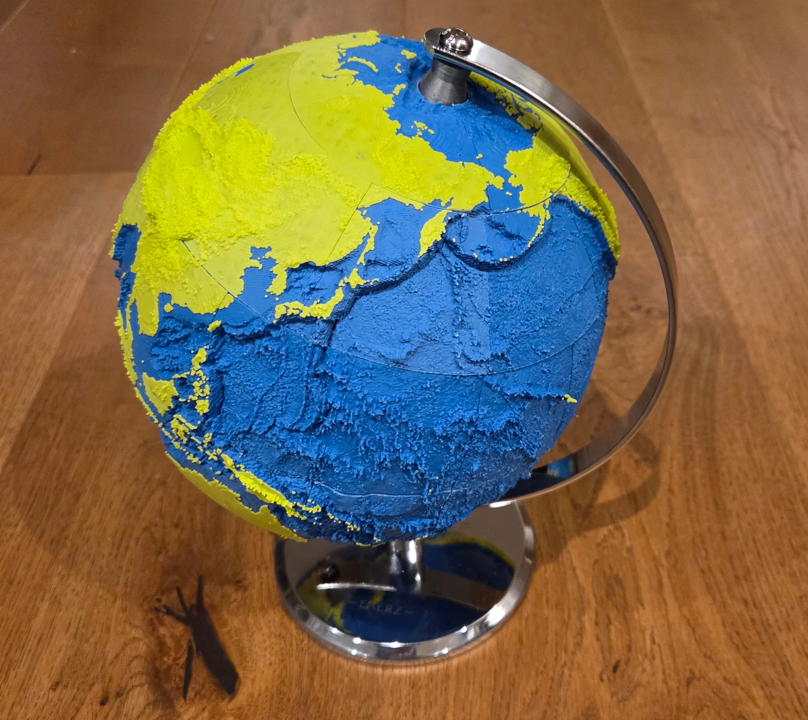
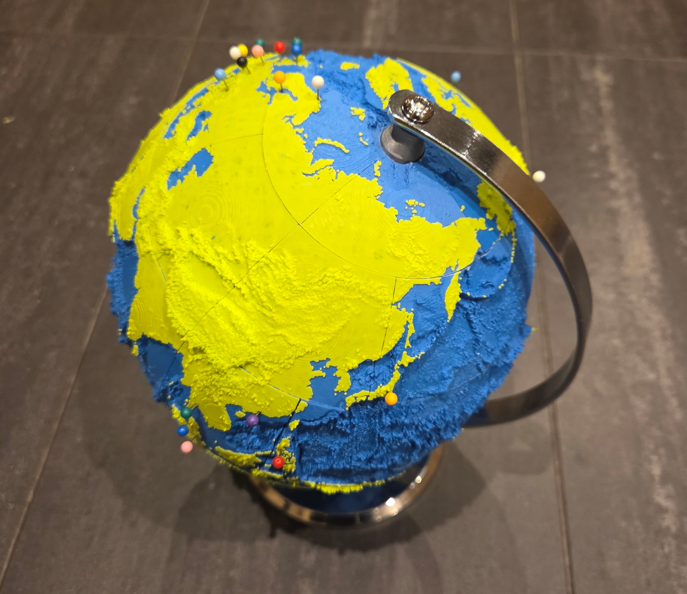
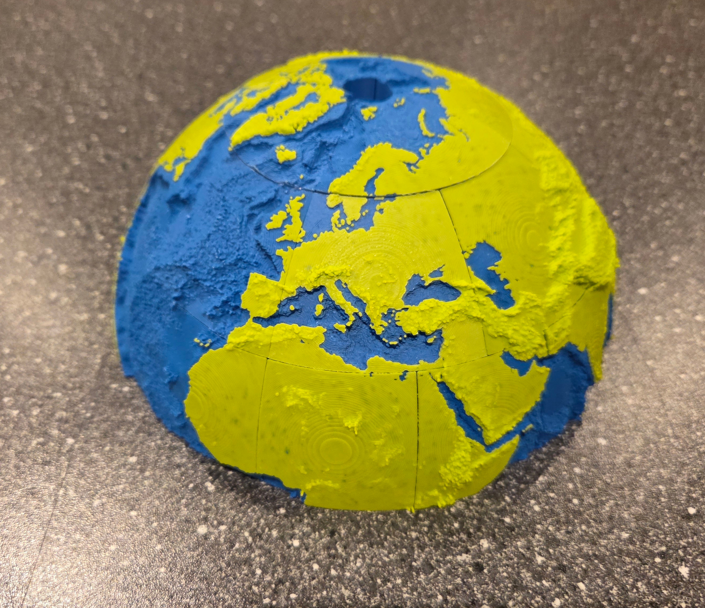
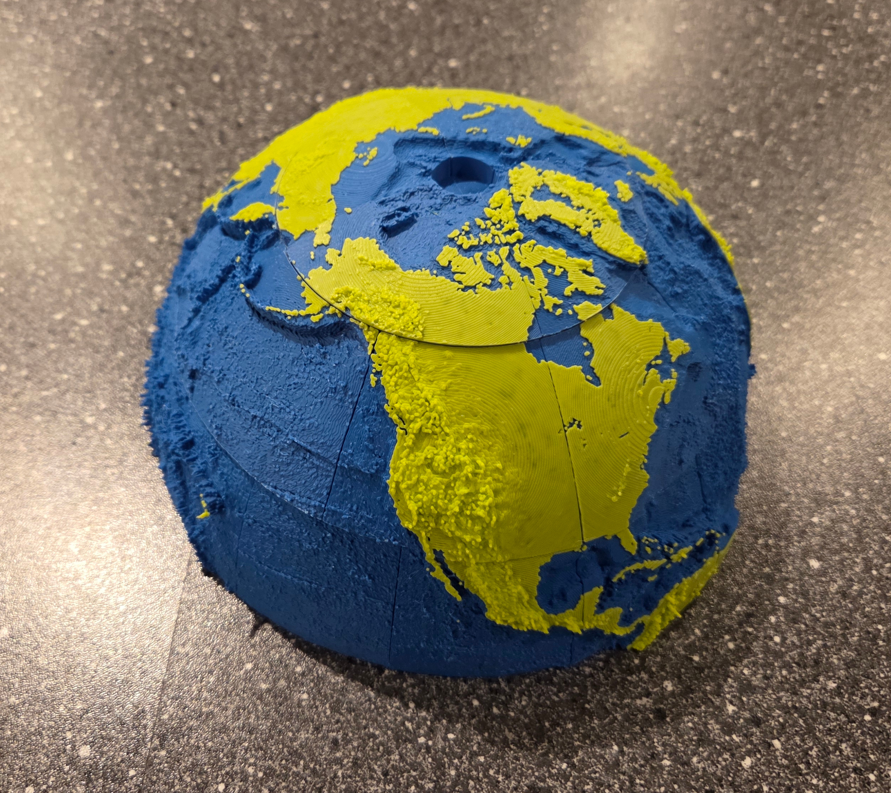
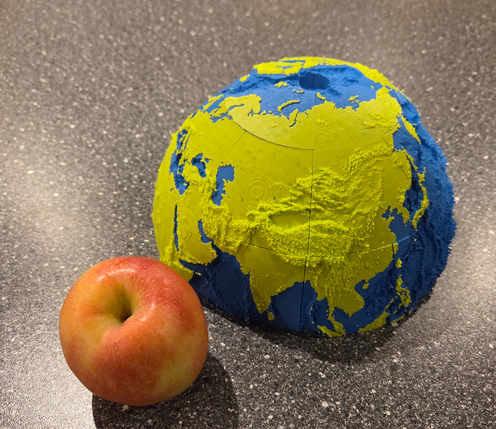
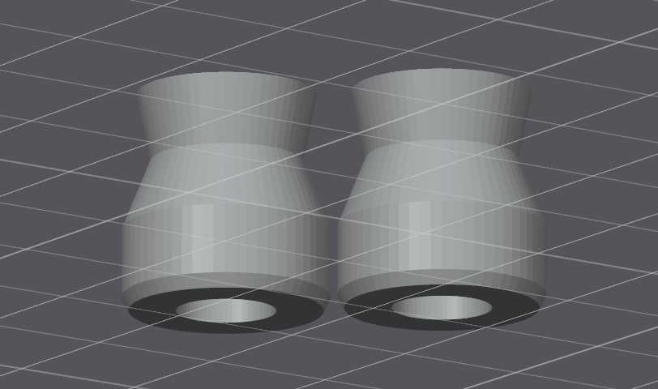

# 3D Globe Segment Generator

Generate 3D-printable segments that assemble into a globe showing the Earth's ocean depth (Bathymetric) and land height (Topographic, or Raised-Relief).

## Overview

This python program combines elevation data and optional snow coverage data to create 3D models of Earth with raised relief features. The globe is divided into 48 segments that can be 3D printed and assembled. It was developed with the help of Claude Code.

## Appearance












## Print Ready 3D Files

The 3mf files are too big for github - they can be found on MakerWorld at:

 - [Northern Hemisphere 3mf on MakerWorld](https://makerworld.com/en/models/2254737-topoglobe-topographic-globe-kit-18cm-northern-half#profileId-2455952)
 - [Southern Hemisphere 3mf on MakerWorld](https://makerworld.com/en/models/2264577-topoglobe-topographic-globe-kit-18cm-southern-half#profileId-2467891)

Note these are from an older version and do not include snap-fit connector pockets yet.

The files are designed for Bambu Studio and have only been printed in a Bambu P1S so far.

## Installation

### Python Dependencies

Install required Python packages:
```bash
pip install -r requirements.txt
```

### Data Files

The geographic data is a bit large and may not be permitted under licensing rules to be included in this repo.

Instead, you will need to download the required data files and place them in the `data/` directory.

There are two data files. You may need to register (for free!) to get access.

#### ETOPO1 1 Arc-Minute Global Relief Model
- Version: ETOPO1 (deprecated!), Bedrock, Grid-Registered
- Download from: https://www.ncei.noaa.gov/products/etopo-global-relief-model
- Format: NetCDF (GMT .grd format)
- Resolution: 60 Arc Seconds
- Post-processing Needed: None
- Target filename: `./data/ETOPO1_Bed_g_gmt4.grd`

#### MODIS Snow Cover (Optional)
- Download from: https://nsidc.org/data/mod10cm
- Spatial Filter: Entire Globe
- Date: I used 1st June 2024 to approximate summer conditions. 
- Download Format: HDF
- Post-processing Needed: Yes
- Use TODO to convert HDF to GeoTIFF in EPSG:4326 projection
- Target filename: `./data/MOD10CM_snow_2024-153.tif`

## Configuration

Edit `config.yaml` if desired:

```yaml
# Data files
etopo_path: "./data/ETOPO1_Bed_g_gmt4.grd"
snow_path: "./data/MOD10CM_snow_2024-153.tif"  # Optional

# Globe parameters
radius_mm: 90.0              # Base radius in millimeters
elevation_range_mm: 15.0     # Height range for elevation features
min_height_mm: 0.2           # Minimum feature height
shell_thickness_mm: 7.0      # Wall thickness of the globe shell

# Grid parameters
step_deg: 0.333333           # Grid cell size in degrees (~37km at the equator)

# Output
output_dir: "./output"       # Directory for 3MF files
```

## Usage

### Generate All 48 Segments

```bash
python3 globe.py
```

This will generate all globe segments (without snow) and save them as 3MF files in the output directory. Takes approximately **9-10 minutes** for all 48 segments at 0.333333° resolution.

### Generate Specific Segments

```bash
python3 globe.py -s N60-90_E000-090 N60-90_E090-180
```

### Enable Snow Layer

```bash
python3 globe.py --snow
```

Snow is disabled by default for faster processing. Use `--snow` to include snow coverage data.

### Command Line Options

```
usage: globe.py [-h] [--config CONFIG] [--segments SEGMENTS [SEGMENTS ...]]
                [--output-dir OUTPUT_DIR] [--snow] [--verbose]

Generate 3D-printable globe segments from elevation data

optional arguments:
  -h, --help            show this help message and exit
  --config CONFIG, -c CONFIG
                        Path to configuration file (default: config.yaml)
  --segments SEGMENTS [SEGMENTS ...], -s SEGMENTS [SEGMENTS ...]
                        Generate specific segments (e.g., N60-90_E000-090)
  --output-dir OUTPUT_DIR, -o OUTPUT_DIR
                        Override output directory from config
  --snow                Enable snow layer (default: disabled)
  --verbose, -v         Enable verbose logging
```

## Segment Pattern

The globe is divided into 48 segments with increasing density towards the poles:

**Northern Hemisphere:**
- 4 segments: 60°-90° N (90° longitude each)
- 8 segments: 30°-60° N (45° longitude each)
- 12 segments: 0°-30° N (30° longitude each)

**Southern Hemisphere:**
- 12 segments: 0°-30° S (30° longitude each)
- 8 segments: 30°-60° S (45° longitude each)
- 4 segments: 60°-90° S (90° longitude each)

Segment naming: `{N|S}{lat_min}-{lat_max}_{E|W}{lon_min}-{lon_max}`

Examples:
- `N60-90_W180-090` - North Pole segment, 90-180° West
- `N60-90_E000-090` - North Pole segment, 0-90° East
- `S30-60_W090-045` - Southern mid-latitude, 45-90° West

## Output

Each segment is exported as a 3MF file containing **separate objects** for multi-color printing:

- **Water layer** - Ocean depths with hollow core (print in blue)
- **Land layer** - Terrain elevation (print in green/brown)
- **Snow layer** - Snow-covered areas (print in white, only if `--snow` enabled)

### Multi-Color Printing

The 3MF files contain each layer as a separate object, allowing you to assign different colors in your slicer:

1. Load the 3MF file in your slicer (PrusaSlicer, Cura, Bambu Studio, etc.)
2. You'll see 2-3 separate objects (water, land, and optionally snow)
3. Assign different colors/materials to each object
4. Slice and print!

### Segment Alignment

Cell boundaries are precisely aligned with segment edges, ensuring adjacent segments fit together perfectly when assembled.

## Architecture

```
globe.py                   # Main entry point - generates segment 3MFs
bambu_3mf.py               # Packages segments into Bambu Studio 3MFs
globe_generator/
├── config.py              # Configuration dataclasses
├── grid_builder.py        # Equal-area grid generation
├── data_processor.py      # Elevation and snow data processing
├── segment_generator.py   # 48-segment definition
├── mesh_generator.py      # Pure-Python mesh generation using trimesh
└── spherical_geometry.py  # Spherical coordinate and geometry utilities
snapfits/                  # Snap-fit connector pocket STL (from Connector1 Slim)
```

**Key Features:**
- **Pure-Python mesh generation**: Direct triangulation using `trimesh` - no external CAD software needed
- **Per-segment cell generation**: Cells are generated with boundaries aligned to segment edges for perfect assembly
- **Vectorized data processing**: 75x faster elevation sampling using NumPy/xarray vectorization
- **Multi-color 3MF export**: Separate objects for water, land, and snow layers
- **Adaptive subdivision**: Shell patches use ~1° per subdivision for smooth surfaces, small cell patches use efficient 4x4 grids

## Performance

**Processing Time (at 0.333333° resolution):**
- Per segment: ~10-12 seconds (pure-Python mesh generation)
- All 48 segments: ~9-10 minutes total
- Data processing: elevation sampling ~2 seconds, cell processing ~5 seconds per segment
- Mesh generation: ~3-5 seconds per segment

**Grid Resolution:**
- Cell size: 0.333333° (~37km at the equator, ~20 arc-minutes)
- Typical segment: 8,000-9,000 cells
- High detail capture of elevation features

**Memory Usage:**
- Python process uses ~500 MB RAM during mesh generation
- Data processing uses minimal memory (~200 MB)
- Total peak usage: < 1 GB

### 3MF File Size

Each segment 3MF file is typically **10-15 MB** at 0.333333° resolution, depending on terrain complexity.

**Total output size:** ~650 MB for all 48 segments

**Adjusting Grid Resolution:**

Edit `config.yaml` to adjust detail level:
- `step_deg: 0.333333` - High detail, ~37km cells (current)
- `step_deg: 0.5` - Medium detail, ~55km cells, faster generation
- `step_deg: 1.0` - Lower detail, ~110km cells, fastest generation

**Adjusting Shell Smoothness:**

Shell patches automatically use ~1° angular subdivision for professional-quality smooth surfaces. To adjust, edit `globe_generator/mesh_generator.py` line 196-197.

## Slicer

### Generating Bambu Studio 3MF Files

After generating the 48 segment 3MFs in `output/`, run `bambu_3mf.py` to produce Bambu Studio-ready files:

```bash
python3 bambu_3mf.py
```

This produces two files in `3mf/`:
- `topoglobe_18_2_north.3mf` - 24 northern hemisphere segments across 4 plates
- `topoglobe_18_2_south.3mf` - 24 southern hemisphere segments across 4 plates

Each file has filament colours pre-assigned (filament 1 = water, filament 2 = land) and segments arranged 6 per plate, so you can open them directly in Bambu Studio and slice.

Options:
```bash
python3 bambu_3mf.py --hemisphere north   # Only one hemisphere
python3 bambu_3mf.py --input-dir output --output-dir 3mf
```

### Print Settings

1. Open the generated 3MF in Bambu Studio.
2. Change the filaments so that filament 1 is the water colour and filament 2 is the land colour.
3. Choose the "0.12mm Fine" profile.
4. Enable support, with type = normal, and maybe Top interface layers = 1.

### Print-Ready Files on MakerWorld

The 3MF files are too big for GitHub. Pre-built print-ready files can be found on MakerWorld, though note these are from an older version and do not include snap-fit connector pockets:

 - [Northern Hemisphere 3mf on MakerWorld](https://makerworld.com/en/models/2254737-topoglobe-topographic-globe-kit-18cm-northern-half#profileId-2455952)
 - [Southern Hemisphere 3mf on MakerWorld](https://makerworld.com/en/models/2264577-topoglobe-topographic-globe-kit-18cm-southern-half#profileId-2467891)


## Assembly

Adjacent segments join together using snap-fit connectors based on [Connector1 Slim by ckolivas on Printables](https://www.printables.com/model/1134923-connector1-slim). Each segment has snap-fit pockets cut into its east and west edges during mesh generation. Print the matching connector pegs separately and snap them in to join segments side by side.

For the north-south joins between latitude bands, use 80/120 grit sandpaper to roughen the edges slightly, then glue with SuperGlue.

Work up/down "ring-by-ring" from the equator, one hemisphere at a time.

## Decoration

The smallest sort of "map push pins" can be used to permanently mark locations (offices, places you've been, etc).

The trick is to heat up the pointy end just enough to plunge it into the globe, being careful to get it right first time - don't change direction.

Don't heat the pin up too much, or either the ball on the end of your pin will fall off, or you'll make a bigger hole than you wanted.  

Here's some specs from an [Example product on Amazon UK](https://www.amazon.co.uk/dp/B07XNQCWY5):

 - Material: plastic, stainless steel.
 - Ball head diameter: 0.13 in (3mm).
 - Needle length: 0.6 in (15mm).

## Stand

I found it easiest to "cannibalise" an existing off-the-shelf globe, and take its stand.

This globe was about the right size and had a very re-use friendly stand:

[Exerz 20cm World Globe Political Map at Amazon UK](https://www.amazon.co.uk/Exerz-20cm-World-Globe-Educational/dp/B08V144XH3)

There is an STL file included in this repo, `stand-attachment.stl`, generated from an OpenSCAD file, `stand-attachment.scad`, to make a suitable connector to join the globe to the stand:



## Testing

The project includes comprehensive test coverage with 32 tests.

### Quick Start

```bash
# Install dev dependencies
pip install -r requirements-dev.txt

# Run all tests
venv/bin/python3 -m pytest tests/ -v

# Run only fast unit tests (no data files required)
venv/bin/python3 -m pytest tests/ -v -m "not integration"
```

### Test Categories

**Unit Tests (24 tests)** - Fast, no data files required
- Configuration loading
- Grid generation algorithms
- Coordinate conversions
- Segment definitions

**Integration Tests (8 tests)** - Require ETOPO1/MODIS data files
- Full pipeline testing
- Data loading and processing
- Segment cell generation
- Cross-segment consistency

Integration tests automatically skip if data files are not present.

### Code Quality

```bash
# Run linters
./lint.sh

# Or individually
venv/bin/python3 -m ruff check .
venv/bin/python3 -m mypy globe_generator/*.py *.py
```

## Known Bugs

 - When in the default "no-snow" mode, some parts of Greenland are shown as water, but actually the land is below sea-level due to the weight of the ice! Sorry Greenland. I probably should have used the ice elevation not the bedrock elevation data set.
 - A few of the Northern Hemisphere segments have non-closed manifolds. They still seem to slice ok.
 - It could do with being quicker to print!
 - The connectors only run east-west, you still have to glue the six "rings" together.
 - Possibly topoglobe could be slightly more aware of the physical limitation of 3d-printing; some very pointy volcanic islands are just too delicate, and some "stringing" occurs around rapid changes in sea-depth.

## License

This project is provided as-is for personal and educational use.

The 3mf files are provided under the Creative Commons Attribution—Noncommercial—Share Alike Licence - http://creativecommons.org/licenses/by-nc-sa/4.0/ .

The "snapfit" connectors used to hold the segments together are made by DexTech https://www.printables.com/@DexTech - see https://www.printables.com/model/1134923-connector1-slim and used under the same licence. Any blame for scaling the snapfits even smaller lies with me, not with DexTech!

On that note, please don't blame me if:
 - your 3D printer gives up or catches fire;
 - you get lost during your solo navigation around the world by coracle using only this globe for navigation;
 - your favourite island is missing. 
